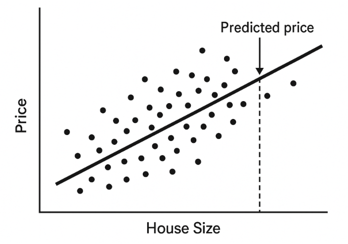
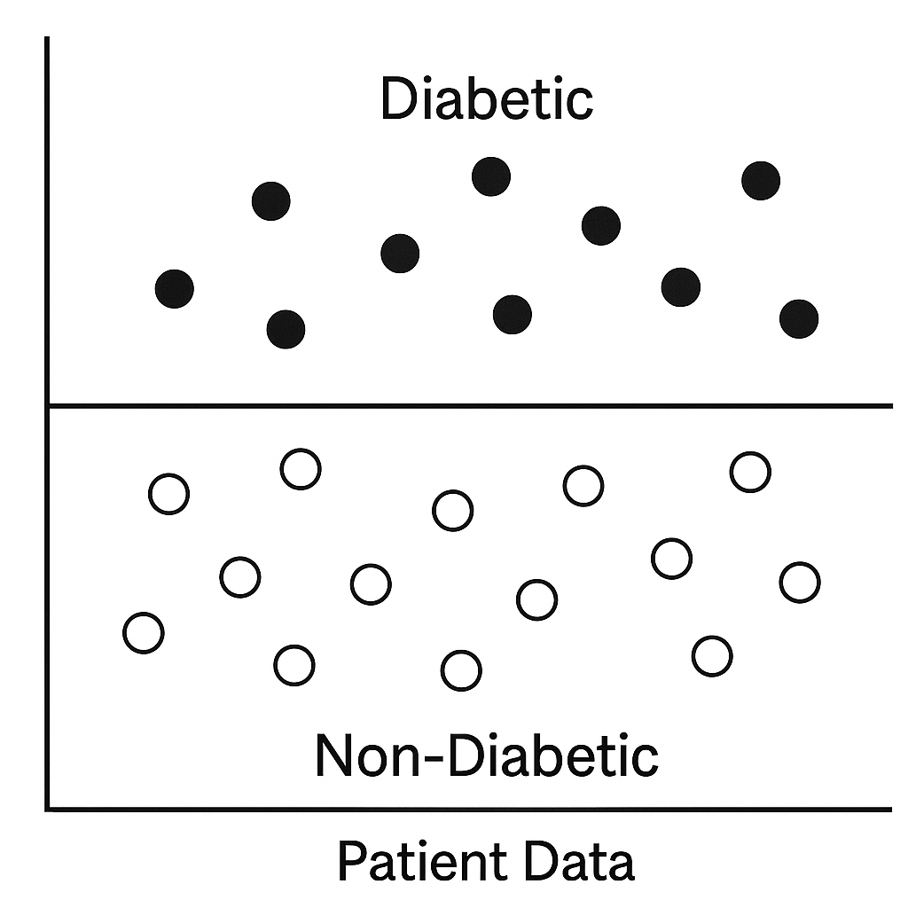
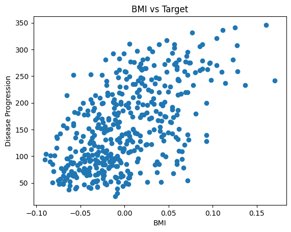

# Fundamentos del Aprendizaje Supervisado

## Objetivos de aprendizaje

Al finalizar este módulo seré capaz de:

- Comprender qué es el aprendizaje supervisado.
- Explicar cómo aprende un modelo a partir de datos etiquetados.
- Diferenciar los problemas de regresión y clasificación.
- Identificar aplicaciones reales del aprendizaje supervisado.

---

## ¿Qué es el Aprendizaje Supervisado?

El aprendizaje supervisado (*Supervised Learning*) es una rama del Machine Learning en la que un modelo aprende utilizando **datos etiquetados**. Cada ejemplo del conjunto de entrenamiento está compuesto por:

- **Variables de entrada (X):** características que describen cada observación.
- **Variable objetivo (y):** respuesta o etiqueta que el modelo debe aprender a predecir.

Durante el entrenamiento, el algoritmo analiza numerosos ejemplos para descubrir la relación entre las variables de entrada y la salida esperada. Una vez aprendido este patrón, el modelo puede realizar predicciones sobre datos nuevos que nunca ha visto.

---

## ¿Cómo aprende un modelo supervisado?

El proceso de aprendizaje puede compararse con la forma en que un profesor enseña a un estudiante mediante ejercicios resueltos.

Por ejemplo:

| Imagen | Etiqueta |
|--------|----------|
| 🐱 | Gato |
| 🐶 | Perro |

Después de observar muchos ejemplos correctamente etiquetados, el estudiante aprende a reconocer nuevos animales.

De forma similar, un algoritmo de aprendizaje supervisado utiliza ejemplos etiquetados para identificar patrones y posteriormente realizar predicciones sobre nuevos datos.

---

## Tipos de problemas en el Aprendizaje Supervisado

Los problemas de aprendizaje supervisado se dividen principalmente en dos categorías:

### Regresión

La regresión se utiliza cuando la variable objetivo es un **valor numérico continuo**.

El modelo aprende la relación entre las variables de entrada y un valor numérico para realizar estimaciones.

#### Ejemplos

- Predicción del precio de una vivienda.
- Estimación de ventas.
- Pronóstico de temperatura.
- Predicción del consumo de energía.

#### Ejemplo práctico

Supongamos el siguiente conjunto de datos:

| Área (m²) | Ubicación | Precio |
|-----------|-----------|---------:|
| 150 | Urbana | \$300 000 |
| 200 | Suburbana | \$450 000 |

El modelo aprende la relación entre el tamaño, la ubicación y el precio para estimar el valor d



### Evaluación de modelos de regresión

Una vez entrenado un modelo de regresión, es necesario evaluar qué tan bien se ajusta a los datos. Para ello se utilizan diferentes métricas que permiten medir la calidad de las predicciones.

Algunas de las métricas más utilizadas son:

- **R² (Coeficiente de determinación):** indica qué proporción de la variabilidad de la variable objetivo es explicada por el modelo. Cuanto más cercano a 1, mejor es el ajuste.

- **Error Cuadrático Medio (MSE):** mide el promedio de los errores al cuadrado entre los valores reales y los valores predichos. Un valor menor indica un mejor desempeño del modelo.

---

## Implementación práctica: Regresión con Diabetes Dataset

Para aplicar los conceptos de regresión supervisada se utiliza el conjunto de datos **Diabetes** disponible en Scikit-learn.

En este ejemplo se implementa un modelo de **Regresión Lineal**, donde:

- Las variables de entrada (**X**) corresponden a las características clínicas de los pacientes.
- La variable objetivo (**y**) representa la progresión de la enfermedad.

El modelo aprende la relación entre las características de los pacientes y la progresión de la enfermedad para realizar predicciones sobre nuevos datos.

📓 [Regresión con Diabetes Dataset](../../notebooks/01_regression_diabetes.ipynb)


### Clasificación

La **clasificación** es un tipo de aprendizaje supervisado cuyo objetivo es predecir una **categoría** o **clase** a partir de un conjunto de características de entrada.

A diferencia de la regresión, donde la salida es un valor numérico continuo, en clasificación la salida pertenece a un conjunto de categorías previamente definidas.

#### Ejemplo práctico

Un profesional de la salud puede utilizar la información clínica de un paciente para determinar si presenta una enfermedad.

En este caso, el modelo puede clasificar al paciente en una de las siguientes categorías:

- **Diabético**
- **No diabético**



### Evaluación de modelos de clasificación

Una vez entrenado un modelo de clasificación, es importante evaluar su desempeño para conocer qué tan bien realiza las predicciones.

Las métricas más utilizadas son:

- **Accuracy (Exactitud):** porcentaje de predicciones correctas realizadas por el modelo.
- **Precision (Precisión):** indica qué proporción de las predicciones positivas realizadas por el modelo son realmente correctas.
- **Recall (Sensibilidad):** mide la capacidad del modelo para identificar correctamente los casos positivos.
- **Matriz de confusión:** muestra la cantidad de predicciones correctas e incorrectas, permitiendo analizar el comportamiento del modelo para cada clase.


## Ejemplo práctico: Clasificación de especies de flores

Para comprender el funcionamiento de un modelo de clasificación, se utiliza el conjunto de datos **Iris** disponible en Scikit-learn.

Este conjunto contiene información sobre diferentes características de flores, como:

- Longitud del sépalo.
- Ancho del sépalo.
- Longitud del pétalo.
- Ancho del pétalo.

El objetivo del modelo es clasificar cada flor en una de tres especies:

- **0 → Setosa**
- **1 → Versicolor**
- **2 → Virginica**

El modelo utilizado es **Regresión Logística**, un algoritmo de clasificación que aprende patrones a partir de ejemplos etiquetados para predecir la clase de nuevas observaciones.

📓 **Notebook relacionado:**

[Clasificación de flores Iris con Regresión Logística](../../notebooks/01_classification_iris.ipynb)


## Conceptos y técnicas clave

### Datos etiquetados

Los **datos etiquetados** son la base del aprendizaje supervisado, ya que proporcionan al modelo ejemplos donde la respuesta correcta ya es conocida.

Cada dato contiene:

- **Variables de entrada (X):** información utilizada por el modelo para aprender.
- **Etiqueta o variable objetivo (y):** resultado que el modelo intenta predecir.

Estos datos permiten que el algoritmo encuentre patrones y relaciones que posteriormente podrá utilizar para realizar predicciones sobre nuevos casos.

#### Ejemplo práctico: Predicción de compras

Un sistema de análisis de ventas puede utilizar información histórica de clientes:

| Entrada | Etiqueta |
|---------|----------|
| Cliente de 30 años, compró zapatos de $50 | 1 (Compró) |
| Cliente de 25 años, gastó $5 | 0 (No compró) |

A partir de estos ejemplos, el modelo aprende patrones relacionados con el comportamiento de los clientes y puede predecir si un nuevo usuario realizará una compra.

---

## División de datos: entrenamiento y prueba

Para evaluar correctamente un modelo de Machine Learning, los datos suelen dividirse en dos grupos principales:

### Conjunto de entrenamiento (*Training Set*)

Es el conjunto de datos utilizado para que el modelo aprenda los patrones existentes.

Durante esta etapa, el algoritmo ajusta sus parámetros utilizando ejemplos conocidos.

### Conjunto de prueba (*Test Set*)

Es un conjunto de datos que el modelo nunca ha visto durante el entrenamiento.

Se utiliza para evaluar si el modelo realmente aprendió patrones generales y no únicamente memorizó los datos utilizados para entrenarse.

#### Ejemplo práctico: Diagnóstico médico

En un sistema de diagnóstico:

**Entrenamiento:**

El modelo analiza historiales médicos donde conoce:

```
Síntomas → Diagnóstico
```

**Prueba:**

El modelo recibe información de nuevos pacientes y realiza predicciones.

Este proceso permite comprobar si el modelo puede funcionar correctamente con pacientes que no formaron parte del entrenamiento.

---

## Sobreajuste e infraajuste

Durante el entrenamiento de un modelo es importante encontrar un equilibrio entre aprender los patrones importantes y evitar aprender información irrelevante.

### Sobreajuste (*Overfitting*)

El sobreajuste ocurre cuando un modelo aprende demasiado los datos de entrenamiento, incluyendo ruido o características específicas que no se generalizan a nuevos datos.

Consecuencia:

- Buen desempeño con datos de entrenamiento.
- Bajo desempeño con datos nuevos.

#### Ejemplo

Un modelo médico podría memorizar síntomas poco comunes de pacientes anteriores y fallar al analizar nuevos pacientes con características ligeramente diferentes.

---

### Infraajuste (*Underfitting*)

El infraajuste ocurre cuando el modelo es demasiado simple y no logra capturar las relaciones importantes presentes en los datos.

Consecuencia:

- Bajo desempeño en entrenamiento.
- Bajo desempeño en datos nuevos.

#### Ejemplo

Un modelo médico demasiado simple podría ignorar combinaciones importantes de síntomas y generar diagnósticos incorrectos.

---

## Aplicaciones reales del Aprendizaje Supervisado

El aprendizaje supervisado tiene aplicaciones en diferentes áreas debido a su capacidad para aprender patrones a partir de datos históricos.

Algunos ejemplos son:

### Salud

- Predicción de enfermedades.
- Apoyo al diagnóstico médico.
- Personalización de tratamientos.

### Finanzas

- Detección de fraude.
- Evaluación de riesgo crediticio.

### Comercio

- Predicción de compras.
- Sistemas de recomendación.
- Pronóstico de ventas.

### Tecnología

- Reconocimiento de imágenes.
- Procesamiento de lenguaje natural.
- Detección de spam.

---

## Resumen del módulo

En este módulo se aprendió que el aprendizaje supervisado utiliza datos etiquetados para entrenar modelos capaces de realizar predicciones.

Los conceptos fundamentales incluyen:

- Datos etiquetados.
- División entre entrenamiento y prueba.
- Capacidad de generalización.
- Problemas de sobreajuste e infraajuste.
- Aplicaciones reales del aprendizaje supervisado.

Estos conceptos serán la base para estudiar algoritmos específicos de Machine Learning en los siguientes módulos.

## Visualización de datos y análisis exploratorio

La visualización de datos es una etapa importante dentro del proceso de Machine Learning, ya que permite comprender mejor la relación entre las variables antes de entrenar un modelo.

Mediante gráficos es posible identificar:

- Tendencias entre variables.
- Posibles relaciones o correlaciones.
- Distribución de los datos.
- Valores atípicos (*outliers*).
- Patrones que pueden ayudar a seleccionar un modelo adecuado.

Algunas técnicas utilizadas son:

- **Gráficos de dispersión (*scatter plots*):** utilizados principalmente para analizar relaciones entre variables numéricas en problemas de regresión.
- **Límites de decisión (*decision boundaries*):** utilizados en problemas de clasificación para observar cómo un modelo separa diferentes categorías.

---

## Ejemplo práctico: Relación entre BMI y progresión de la enfermedad

Para aplicar la visualización de datos, se utiliza el conjunto de datos **Diabetes** disponible en Scikit-learn.

El objetivo es analizar si existe alguna relación entre el **Índice de Masa Corporal (BMI)** y la **progresión de la enfermedad**.

Las variables analizadas son:

- **Eje X:** BMI (Índice de Masa Corporal).
- **Eje Y:** Progresión de la enfermedad (*Disease Progression*).

El gráfico de dispersión permite observar cómo se distribuyen los datos y determinar si existe algún patrón entre ambas variables.



### Interpretación de la visualización

El patrón de los puntos permite analizar la relación entre el BMI y la progresión de la enfermedad.

Algunas posibles interpretaciones:

- Una tendencia ascendente indicaría una posible relación positiva, donde valores mayores de BMI podrían estar asociados con una mayor progresión de la enfermedad.
- Una tendencia descendente indicaría una posible relación negativa.
- Una distribución sin una tendencia clara podría indicar una relación débil entre ambas variables.

Este análisis permite comprender mejor los datos antes de seleccionar y entrenar un modelo de Machine Learning.

---

## Implementación práctica

El código utilizado para generar esta visualización se encuentra en el siguiente notebook:

📓 [Visualización de datos Diabetes](../../notebooks/01_visualization_diabetes.ipynb)


---

## Importancia de la visualización en Machine Learning

El análisis visual ayuda a comprender la estructura de los datos antes de construir un modelo.

Estas observaciones permiten determinar si las relaciones entre variables son:

- Lineales.
- No lineales.
- Más complejas.

Esta información ayuda a elegir algoritmos adecuados y mejorar el proceso de modelado.

---

## Ejemplos prácticos de aprendizaje supervisado

### 📈 Regresión: Predicción de ventas a partir de publicidad

En este ejemplo se aplica un modelo de regresión para predecir ventas utilizando información sobre inversión en publicidad.

Variables utilizadas:

- TV.
- Radio.
- Newspaper.

El objetivo es aprender la relación entre la inversión publicitaria y las ventas esperadas.

📓 [Predicción de ventas con regresión](../../notebooks/01_sales_prediction_regression.ipynb)


---

### 🏥 Clasificación: Predicción de diabetes

En este ejemplo se utiliza un modelo de clasificación para predecir si un paciente presenta diabetes utilizando sus características clínicas.

El modelo aprende patrones a partir de datos históricos de pacientes y clasifica nuevos casos.

📓 [Predicción de diabetes con clasificación](../../notebooks/01_diabetes_classification.ipynb)

---

# Conclusión

El aprendizaje supervisado es uno de los pilares fundamentales del Machine Learning, ya que permite construir modelos capaces de aprender a partir de datos etiquetados y realizar predicciones sobre nuevos casos.

Durante este módulo se estudiaron conceptos fundamentales como:

- Datos etiquetados.
- Regresión y clasificación.
- División de datos en entrenamiento y prueba.
- Sobreajuste e infraajuste.
- Evaluación de modelos.
- Importancia de la visualización de datos.

Estos conceptos forman la base para comprender algoritmos más avanzados y desarrollar soluciones de Machine Learning aplicadas a problemas reales.

En los siguientes módulos se profundizará en algoritmos específicos y su implementación utilizando Python y Scikit-learn.
